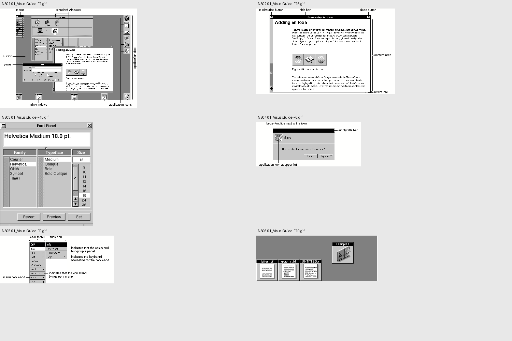
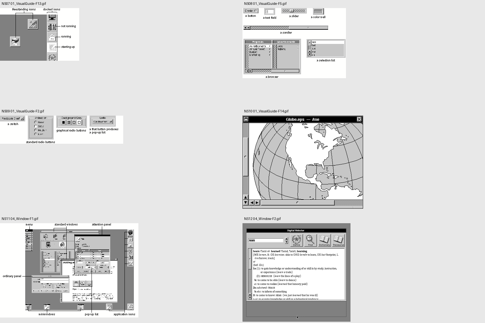
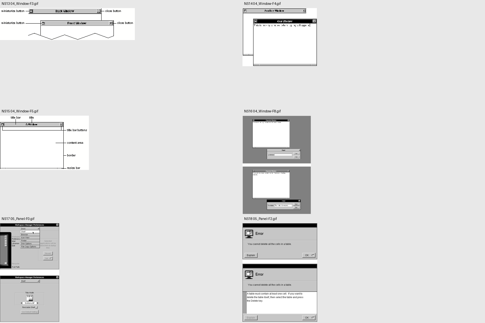
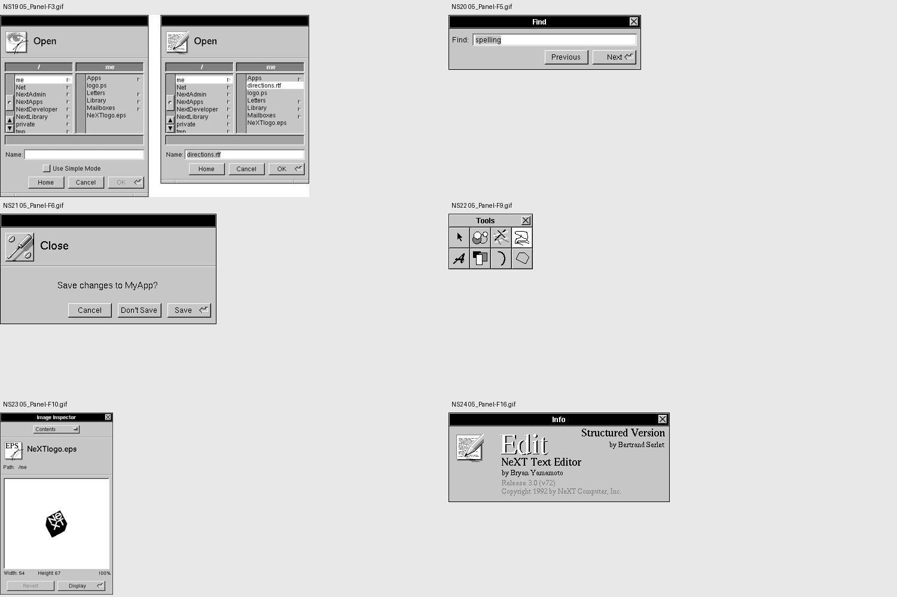
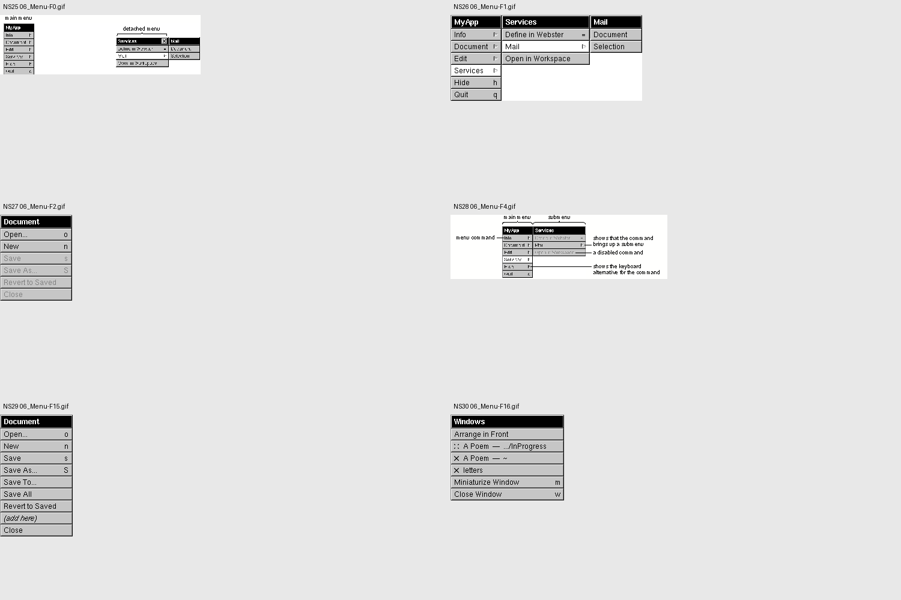
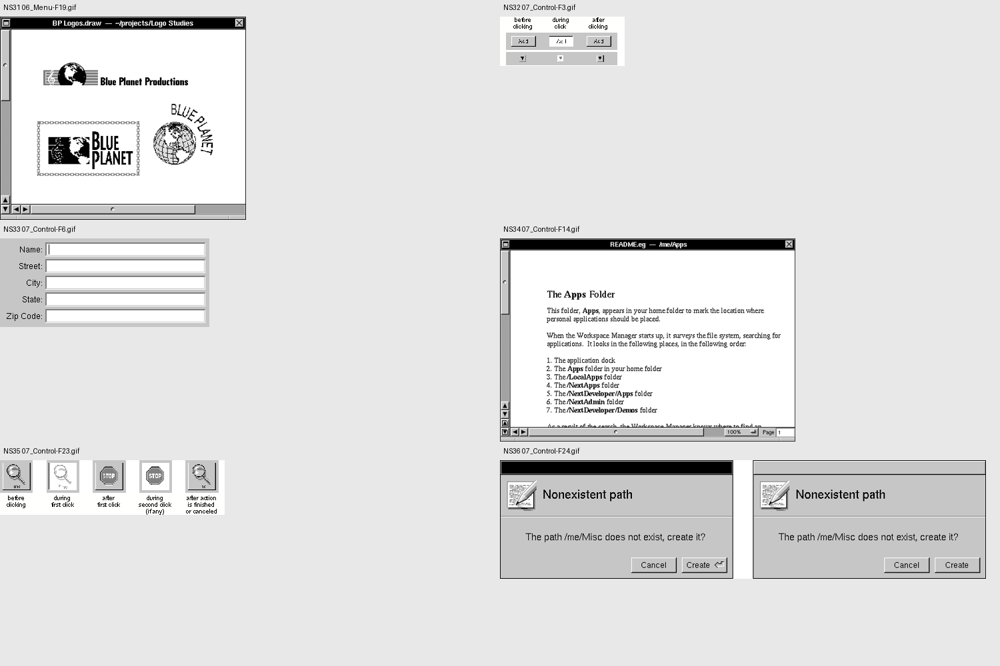

# NeXTSTEP research corpus

36 distinct original GIF illustrations from NeXT’s **NEXTSTEP User Interface Guidelines, Release 3.3 (1995)**, preserved at their retrieved dimensions. These include annotated workspace screenshots, application windows, menus and state diagrams. They are **not 36 independent full-desktop captures**. No OPENSTEP, Rhapsody or Window Maker images are included. The concentration on a single primary manual makes the target coherent; it does not establish how every third-party application looked.

Retrieved 2026-09-07 from the [original-manual mirror](https://www.nextop.de/NeXTstep_3.3_Developer_Documentation/). Original illustrations © NeXT Computer, Inc.; included here as attributed research references, not licensed product artwork. The implementation loads none of these images. The separate Haiku app artwork is MIT licensed. `manifest.json` records exact image and chapter URLs, dimensions, byte counts and SHA-256 checksums. Contact sheets are convenience derivatives; they do not increase the corpus count.

All 36 images were visually inspected. The observations below describe their pixels; the final column records the proposed adaptation, not a claim about historic behavior. See [the implementation specification](design-system.md) for normative rules and explicitly documented departures.

## Contact sheet 1

### NS01 · Workspace anatomy

[Full-size image](corpus/01_VisualGuide-F1.gif) · [Original image](https://www.nextop.de/NeXTstep_3.3_Developer_Documentation/UserInterface/01_VisualGuide/VisualGuide.htmld/F1.gif) · [Source chapter](https://www.nextop.de/NeXTstep_3.3_Developer_Documentation/UserInterface/01_VisualGuide/VisualGuide.htmld/index.html) · 401 × 292

Observation: Medium-gray desktop; separate upper-left menu and right-hand dock; white documents float above it.

Design consequence: Reserve space for the palette and dock; avoid a full-width site header.

### NS02 · Document anatomy

[Full-size image](corpus/01_VisualGuide-F16.gif) · [Original image](https://www.nextop.de/NeXTstep_3.3_Developer_Documentation/UserInterface/01_VisualGuide/VisualGuide.htmld/F16.gif) · [Source chapter](https://www.nextop.de/NeXTstep_3.3_Developer_Documentation/UserInterface/01_VisualGuide/VisualGuide.htmld/index.html) · 407 × 250

Observation: Centered black title strip, miniature control left, X right; narrow frame surrounds paper.

Design consequence: Put controls in the observed order and keep the content dominant.

### NS03 · Font panel

[Full-size image](corpus/01_VisualGuide-F15.gif) · [Original image](https://www.nextop.de/NeXTstep_3.3_Developer_Documentation/UserInterface/01_VisualGuide/VisualGuide.htmld/F15.gif) · [Source chapter](https://www.nextop.de/NeXTstep_3.3_Developer_Documentation/UserInterface/01_VisualGuide/VisualGuide.htmld/index.html) · 298 × 333

Observation: Gray form surface contains white previews, inset lists and rectangular action buttons.

Design consequence: Use gray for controls and white for reading or entry surfaces.

### NS04 · Save attention panel

[Full-size image](corpus/01_VisualGuide-F6.gif) · [Original image](https://www.nextop.de/NeXTstep_3.3_Developer_Documentation/UserInterface/01_VisualGuide/VisualGuide.htmld/F6.gif) · [Source chapter](https://www.nextop.de/NeXTstep_3.3_Developer_Documentation/UserInterface/01_VisualGuide/VisualGuide.htmld/index.html) · 308 × 130

Observation: Empty black title, app illustration, gray message and small action row.

Design consequence: Do not imitate a Save dialog for a read-only blog.

### NS05 · Menu anatomy

[Full-size image](corpus/01_VisualGuide-F0.gif) · [Original image](https://www.nextop.de/NeXTstep_3.3_Developer_Documentation/UserInterface/01_VisualGuide/VisualGuide.htmld/F0.gif) · [Source chapter](https://www.nextop.de/NeXTstep_3.3_Developer_Documentation/UserInterface/01_VisualGuide/VisualGuide.htmld/index.html) · 333 × 140

Observation: A compact vertical stack branches sideways; headers are black and rows gray.

Design consequence: Use a palette with a single Recents submenu.

### NS06 · Miniwindows

[Full-size image](corpus/01_VisualGuide-F10.gif) · [Original image](https://www.nextop.de/NeXTstep_3.3_Developer_Documentation/UserInterface/01_VisualGuide/VisualGuide.htmld/F10.gif) · [Source chapter](https://www.nextop.de/NeXTstep_3.3_Developer_Documentation/UserInterface/01_VisualGuide/VisualGuide.htmld/index.html) · 356 × 134

Observation: Small gray squares carry black title caps and miniature document contents.

Design consequence: Minimizing must create a recoverable tile, separate from closing.

## Contact sheet 2

### NS07 · Application dock

[Full-size image](corpus/01_VisualGuide-F13.gif) · [Original image](https://www.nextop.de/NeXTstep_3.3_Developer_Documentation/UserInterface/01_VisualGuide/VisualGuide.htmld/F13.gif) · [Source chapter](https://www.nextop.de/NeXTstep_3.3_Developer_Documentation/UserInterface/01_VisualGuide/VisualGuide.htmld/index.html) · 245 × 163

Observation: Application icons form a tight vertical edge stack; freestanding icons share their square scale.

Design consequence: Place three stable app tiles at the right edge.

### NS08 · Control families

[Full-size image](corpus/01_VisualGuide-F5.gif) · [Original image](https://www.nextop.de/NeXTstep_3.3_Developer_Documentation/UserInterface/01_VisualGuide/VisualGuide.htmld/F5.gif) · [Source chapter](https://www.nextop.de/NeXTstep_3.3_Developer_Documentation/UserInterface/01_VisualGuide/VisualGuide.htmld/index.html) · 320 × 217

Observation: White recessed entry fields differ from raised buttons; lists stay visually compact.

Design consequence: One shared bevel recipe and input recipe, not per-component styling.

### NS09 · Choice controls

[Full-size image](corpus/01_VisualGuide-F2.gif) · [Original image](https://www.nextop.de/NeXTstep_3.3_Developer_Documentation/UserInterface/01_VisualGuide/VisualGuide.htmld/F2.gif) · [Source chapter](https://www.nextop.de/NeXTstep_3.3_Developer_Documentation/UserInterface/01_VisualGuide/VisualGuide.htmld/index.html) · 381 × 87

Observation: Radio groups, switches and popups have distinct representations.

Design consequence: Avoid decorative toggles for commands with no persistent choice.

### NS10 · Image document

[Full-size image](corpus/01_VisualGuide-F14.gif) · [Original image](https://www.nextop.de/NeXTstep_3.3_Developer_Documentation/UserInterface/01_VisualGuide/VisualGuide.htmld/F14.gif) · [Source chapter](https://www.nextop.de/NeXTstep_3.3_Developer_Documentation/UserInterface/01_VisualGuide/VisualGuide.htmld/index.html) · 373 × 288

Observation: Black title and a very thin dark frame; left scroller and bottom resize ledge.

Design consequence: Use crisp edges without a soft elevation cloud.

### NS11 · Layered workspace

[Full-size image](corpus/04_Window-F1.gif) · [Original image](https://www.nextop.de/NeXTstep_3.3_Developer_Documentation/UserInterface/04_Window/Window.htmld/F1.gif) · [Source chapter](https://www.nextop.de/NeXTstep_3.3_Developer_Documentation/UserInterface/04_Window/Window.htmld/index.html) · 428 × 292

Observation: Menu, dock, documents and attention panels form distinct layers.

Design consequence: Keep navigation reachable above document windows.

### NS12 · Interactive resizing

[Full-size image](corpus/04_Window-F2.gif) · [Original image](https://www.nextop.de/NeXTstep_3.3_Developer_Documentation/UserInterface/04_Window/Window.htmld/F2.gif) · [Source chapter](https://www.nextop.de/NeXTstep_3.3_Developer_Documentation/UserInterface/04_Window/Window.htmld/index.html) · 557 × 508

Observation: A bottom edge and outline communicate changing window bounds.

Design consequence: Make the bottom resize bar functional and keep it within the work area.

## Contact sheet 3

### NS13 · Title-bar widgets

[Full-size image](corpus/04_Window-F3.gif) · [Original image](https://www.nextop.de/NeXTstep_3.3_Developer_Documentation/UserInterface/04_Window/Window.htmld/F3.gif) · [Source chapter](https://www.nextop.de/NeXTstep_3.3_Developer_Documentation/UserInterface/04_Window/Window.htmld/index.html) · 417 × 99

Observation: Miniaturize precedes the title; Close follows it. Unsaved documents have a distinct close state.

Design consequence: Use an X, omit unsaved indicators because this blog is read-only.

### NS14 · Active and inactive windows

[Full-size image](corpus/04_Window-F4.gif) · [Original image](https://www.nextop.de/NeXTstep_3.3_Developer_Documentation/UserInterface/04_Window/Window.htmld/F4.gif) · [Source chapter](https://www.nextop.de/NeXTstep_3.3_Developer_Documentation/UserInterface/04_Window/Window.htmld/index.html) · 230 × 180

Observation: Black active title with white lettering; inactive title gray with black lettering. Document bodies remain opaque.

Design consequence: Focus changes title chrome, never text readability or opacity.

### NS15 · Window frame parts

[Full-size image](corpus/04_Window-F5.gif) · [Original image](https://www.nextop.de/NeXTstep_3.3_Developer_Documentation/UserInterface/04_Window/Window.htmld/F5.gif) · [Source chapter](https://www.nextop.de/NeXTstep_3.3_Developer_Documentation/UserInterface/04_Window/Window.htmld/index.html) · 275 × 168

Observation: The resize bar is a narrow divided strip at the bottom, not a diagonal browser corner.

Design consequence: Use three joined resize zones and a one-pixel perimeter.

### NS16 · Main versus key window

[Full-size image](corpus/04_Window-F8.gif) · [Original image](https://www.nextop.de/NeXTstep_3.3_Developer_Documentation/UserInterface/04_Window/Window.htmld/F8.gif) · [Source chapter](https://www.nextop.de/NeXTstep_3.3_Developer_Documentation/UserInterface/04_Window/Window.htmld/index.html) · 325 × 468

Observation: A key panel gets the black title; its associated main document uses an intermediate title treatment.

Design consequence: This single-app blog uses one active document; do not claim to implement the full key/main model.

### NS17 · Workspace preferences

[Full-size image](corpus/05_Panel-F0.gif) · [Original image](https://www.nextop.de/NeXTstep_3.3_Developer_Documentation/UserInterface/05_Panel/Panel.htmld/F0.gif) · [Source chapter](https://www.nextop.de/NeXTstep_3.3_Developer_Documentation/UserInterface/05_Panel/Panel.htmld/index.html) · 395 × 660

Observation: Gray controls and white selected rows are contained in a bounded panel.

Design consequence: A selected menu row is white, not the old blue Windows accent.

### NS18 · Error panel expansion

[Full-size image](corpus/05_Panel-F2.gif) · [Original image](https://www.nextop.de/NeXTstep_3.3_Developer_Documentation/UserInterface/05_Panel/Panel.htmld/F2.gif) · [Source chapter](https://www.nextop.de/NeXTstep_3.3_Developer_Documentation/UserInterface/05_Panel/Panel.htmld/index.html) · 378 × 500

Observation: A message can expand its content area while retaining the same panel language.

Design consequence: Reader failure and retry stay inside their document frame.

## Contact sheet 4

### NS19 · Open panel

[Full-size image](corpus/05_Panel-F3.gif) · [Original image](https://www.nextop.de/NeXTstep_3.3_Developer_Documentation/UserInterface/05_Panel/Panel.htmld/F3.gif) · [Source chapter](https://www.nextop.de/NeXTstep_3.3_Developer_Documentation/UserInterface/05_Panel/Panel.htmld/index.html) · 620 × 366

Observation: File browser columns, path labels and entry fields share gray chrome and inset white regions.

Design consequence: Archive uses one flat icon field per user request, without fake filesystem paths.

### NS20 · Find panel

[Full-size image](corpus/05_Panel-F5.gif) · [Original image](https://www.nextop.de/NeXTstep_3.3_Developer_Documentation/UserInterface/05_Panel/Panel.htmld/F5.gif) · [Source chapter](https://www.nextop.de/NeXTstep_3.3_Developer_Documentation/UserInterface/05_Panel/Panel.htmld/index.html) · 322 × 92

Observation: A small panel closely wraps one input and two actions.

Design consequence: About and compact-mode windows must fit content, with desktop visible below.

### NS21 · Close attention panel

[Full-size image](corpus/05_Panel-F6.gif) · [Original image](https://www.nextop.de/NeXTstep_3.3_Developer_Documentation/UserInterface/05_Panel/Panel.htmld/F6.gif) · [Source chapter](https://www.nextop.de/NeXTstep_3.3_Developer_Documentation/UserInterface/05_Panel/Panel.htmld/index.html) · 362 × 185

Observation: Three concrete choices are shown only when unsaved work requires a decision.

Design consequence: Closing a read-only post is immediate, with no confirmation or extra menu.

### NS22 · Tools palette

[Full-size image](corpus/05_Panel-F9.gif) · [Original image](https://www.nextop.de/NeXTstep_3.3_Developer_Documentation/UserInterface/05_Panel/Panel.htmld/F9.gif) · [Source chapter](https://www.nextop.de/NeXTstep_3.3_Developer_Documentation/UserInterface/05_Panel/Panel.htmld/index.html) · 141 × 93

Observation: Adjacent square tools use shared edges rather than floating rounded cards.

Design consequence: Dock tiles join into a coherent stack.

### NS23 · Image inspector

[Full-size image](corpus/05_Panel-F10.gif) · [Original image](https://www.nextop.de/NeXTstep_3.3_Developer_Documentation/UserInterface/05_Panel/Panel.htmld/F10.gif) · [Source chapter](https://www.nextop.de/NeXTstep_3.3_Developer_Documentation/UserInterface/05_Panel/Panel.htmld/index.html) · 274 × 442

Observation: Gray metadata surrounds a white preview; disabled actions are visibly subdued.

Design consequence: Disable unavailable window commands and retain readable labels.

### NS24 · Application info

[Full-size image](corpus/05_Panel-F16.gif) · [Original image](https://www.nextop.de/NeXTstep_3.3_Developer_Documentation/UserInterface/05_Panel/Panel.htmld/F16.gif) · [Source chapter](https://www.nextop.de/NeXTstep_3.3_Developer_Documentation/UserInterface/05_Panel/Panel.htmld/index.html) · 370 × 150

Observation: The small Info panel uses typography and an app image within gray chrome.

Design consequence: About is a compact information panel, not a full-height document shell.

## Contact sheet 5

### NS25 · Detached menus

[Full-size image](corpus/06_Menu-F0.gif) · [Original image](https://www.nextop.de/NeXTstep_3.3_Developer_Documentation/UserInterface/06_Menu/Menu.htmld/F0.gif) · [Source chapter](https://www.nextop.de/NeXTstep_3.3_Developer_Documentation/UserInterface/06_Menu/Menu.htmld/index.html) · 334 × 99

Observation: A detached submenu has its own black title and Close control.

Design consequence: Our submenu remains attached; no fake tear-off handle or Close widget.

### NS26 · Attached menu cascade

[Full-size image](corpus/06_Menu-F1.gif) · [Original image](https://www.nextop.de/NeXTstep_3.3_Developer_Documentation/UserInterface/06_Menu/Menu.htmld/F1.gif) · [Source chapter](https://www.nextop.de/NeXTstep_3.3_Developer_Documentation/UserInterface/06_Menu/Menu.htmld/index.html) · 319 × 143

Observation: Submenu titles align horizontally; the chosen parent row turns white; arrows occupy the right edge.

Design consequence: Desktop Recents opens beside the main palette with a visible heading.

### NS27 · Disabled menu commands

[Full-size image](corpus/06_Menu-F2.gif) · [Original image](https://www.nextop.de/NeXTstep_3.3_Developer_Documentation/UserInterface/06_Menu/Menu.htmld/F2.gif) · [Source chapter](https://www.nextop.de/NeXTstep_3.3_Developer_Documentation/UserInterface/06_Menu/Menu.htmld/index.html) · 120 × 143

Observation: Unavailable actions are gray against a gray row with the same geometry.

Design consequence: Zoom and Arrange disable when there is no target.

### NS28 · Menu semantics

[Full-size image](corpus/06_Menu-F4.gif) · [Original image](https://www.nextop.de/NeXTstep_3.3_Developer_Documentation/UserInterface/06_Menu/Menu.htmld/F4.gif) · [Source chapter](https://www.nextop.de/NeXTstep_3.3_Developer_Documentation/UserInterface/06_Menu/Menu.htmld/index.html) · 361 × 107

Observation: Short command labels, right-aligned submenu arrows and keyboard equivalents have separate jobs.

Design consequence: Only show shortcuts that are implemented; do not decorate commands with arbitrary icons.

### NS29 · Document menu

[Full-size image](corpus/06_Menu-F15.gif) · [Original image](https://www.nextop.de/NeXTstep_3.3_Developer_Documentation/UserInterface/06_Menu/Menu.htmld/F15.gif) · [Source chapter](https://www.nextop.de/NeXTstep_3.3_Developer_Documentation/UserInterface/06_Menu/Menu.htmld/index.html) · 121 × 203

Observation: A dense vertical command stack uses thin seams and a dark title.

Design consequence: Remove website-like header links and use consistent menu rows.

### NS30 · Window menu

[Full-size image](corpus/06_Menu-F16.gif) · [Original image](https://www.nextop.de/NeXTstep_3.3_Developer_Documentation/UserInterface/06_Menu/Menu.htmld/F16.gif) · [Source chapter](https://www.nextop.de/NeXTstep_3.3_Developer_Documentation/UserInterface/06_Menu/Menu.htmld/index.html) · 189 × 143

Observation: Window operations and document names are grouped as application commands.

Design consequence: Keep the user-requested Recents list to exactly three posts; minimized tiles handle other restoration.

## Contact sheet 6

### NS31 · Drawing application

[Full-size image](corpus/06_Menu-F19.gif) · [Original image](https://www.nextop.de/NeXTstep_3.3_Developer_Documentation/UserInterface/06_Menu/Menu.htmld/F19.gif) · [Source chapter](https://www.nextop.de/NeXTstep_3.3_Developer_Documentation/UserInterface/06_Menu/Menu.htmld/index.html) · 437 × 361

Observation: A large paper canvas sits inside restrained title and scrolling chrome.

Design consequence: Remove the redundant Article/Open page toolbar from every reader.

### NS32 · Pressed buttons

[Full-size image](corpus/07_Control-F3.gif) · [Original image](https://www.nextop.de/NeXTstep_3.3_Developer_Documentation/UserInterface/07_Control/Control.htmld/F3.gif) · [Source chapter](https://www.nextop.de/NeXTstep_3.3_Developer_Documentation/UserInterface/07_Control/Control.htmld/index.html) · 187 × 74

Observation: The button face becomes white while pressed; its label remains legible.

Design consequence: Use white pressed/open states and reversed bevels.

### NS33 · Text entry

[Full-size image](corpus/07_Control-F6.gif) · [Original image](https://www.nextop.de/NeXTstep_3.3_Developer_Documentation/UserInterface/07_Control/Control.htmld/F6.gif) · [Source chapter](https://www.nextop.de/NeXTstep_3.3_Developer_Documentation/UserInterface/07_Control/Control.htmld/index.html) · 314 × 133

Observation: White rectangular fields have dark upper-left edges and light lower-right edges.

Design consequence: Archive search uses the shared inset recipe with a visible keyboard focus cue.

### NS34 · Reading a document

[Full-size image](corpus/07_Control-F14.gif) · [Original image](https://www.nextop.de/NeXTstep_3.3_Developer_Documentation/UserInterface/07_Control/Control.htmld/F14.gif) · [Source chapter](https://www.nextop.de/NeXTstep_3.3_Developer_Documentation/UserInterface/07_Control/Control.htmld/index.html) · 569 × 392

Observation: Serif text, generous white margins and a restrained toolbar separate content from system UI.

Design consequence: Preserve readable blog typography and limit line length rather than shrinking text to historic pixels.

### NS35 · Action state feedback

[Full-size image](corpus/07_Control-F23.gif) · [Original image](https://www.nextop.de/NeXTstep_3.3_Developer_Documentation/UserInterface/07_Control/Control.htmld/F23.gif) · [Source chapter](https://www.nextop.de/NeXTstep_3.3_Developer_Documentation/UserInterface/07_Control/Control.htmld/index.html) · 337 × 82

Observation: The running action changes its actual icon/meaning; the pressed phase remains visually distinct.

Design consequence: Show state only where it corresponds to a real action.

### NS36 · Default action focus

[Full-size image](corpus/07_Control-F24.gif) · [Original image](https://www.nextop.de/NeXTstep_3.3_Developer_Documentation/UserInterface/07_Control/Control.htmld/F24.gif) · [Source chapter](https://www.nextop.de/NeXTstep_3.3_Developer_Documentation/UserInterface/07_Control/Control.htmld/index.html) · 760 × 185

Observation: A Return indicator belongs to an actual key-panel default action and disappears in an inactive panel.

Design consequence: Do not add decorative Return glyphs or global Enter shortcuts to blog buttons.

