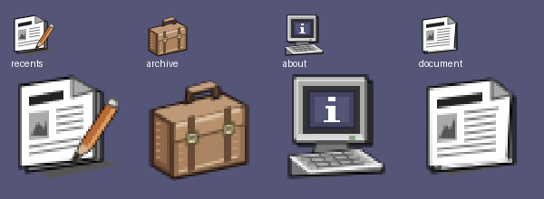
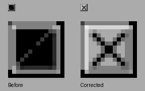

# NeXTSTEP implementation review

Reviewed 2026-09-07 against [the design system](design-system.md), written before implementation, and [all 36 original reference images](README.md). This is a source, CSS-cascade and automated behavior review. The historical corpus was visually inspected; the implemented site has **not** passed a rendered-browser review.

## Typography refinement: current review

IMG_0615.png shows a material inconsistency: Archive’s search placeholder is monospaced while Find, file names and window titles are proportional. Source inspection confirms greyUI’s `.greyui-input` explicitly selects `--greyui-font-mono`; this was not a browser glitch. The previous design system also permitted unrelated editorial headings. The revised [typography contract](design-system.md#typography-and-scale) was documented before this correction.

| Finding | Evidence and correction |
| --- | --- |
| Monospace search value/placeholder | Override the input family with the Helvetica system token, regular weight, normal tracking and style. Placeholder inherits font and tracking. Preserve the 16px input size and 44px compact control height. |
| Pale placeholder differs by browser defaults | Set secondary #333 at opacity 1 on white; retain a distinct placeholder without reducing readability. |
| Multiple unrelated heading families and weights | Remove Newsreader italic 500 and Georgia 600 from enhanced article/About headings. Use upright Helvetica bold 700 with normal tracking. Keep the reading size/line-height and responsive h1 scale. |
| Modern code stack leaks into the historic theme | Use Courier/Courier New for source text; reserve monospace for code. This is an explicit substitute, not an Ohlfs recreation. |
| Legacy styles can silently restore old choices | Scope body/heading/editorial/code aliases to the desktop’s family tokens. Set strong/b/th to the shared bold weight. Static fallback retains its original stylesheet. |
| Typeface versus exact reproduction | Primary Font API documents regular/bold system roles; CERN documents Helvetica and historic fixed-pitch faces. Installed Helvetica with Arial fallback is the selected web mapping. Font availability and rasterization still vary; no bitmap-exact claim. |

Review also checked existing menu/header focus, title control contrast, inactive document readability, flat Archive chronology, and compact window behavior through the existing regression suite. The material/color/icon specification remains unchanged. A final diff review caught and corrected an accidentally broadened compact heading selector before publication.

Validation: full build and TypeScript checks; 26 automated tests, including typography checks in 320/390/768/1440 configurations against the real greyUI + legacy + desktop stylesheet stack. The typography test checks search rest/focus/active declarations, placeholder inheritance/contrast, actual fetched article headings/code, title and About roles. These are DOM/cascade assertions, not physical viewport measurements. The cascade helper now permits explicit pseudo-element inspection; it does not emulate font rasterization or general shorthand expansion.

**Remaining gate:** the browser tab connection again timed out after 20 seconds. No new rendered site screenshots were obtained. Actual Helvetica/fallback glyphs, post-change line wrapping, mobile scrolling and zoom still require browser sign-off. The screenshot and historical references support the findings; passing source checks do not close this visual gate.

## Color-reference correction: current review

The user-supplied screenshot IMG_0609.png demonstrated that the previous implementation was not visually faithful. NS37–NS40, now preserved with exact attachment provenance, correct the research target. The corpus is now 40 images: 36 manual illustrations plus four distinct color desktop references. The smaller duplicate File Viewer screenshot and the failing blog screenshot are not counted as additional NeXTSTEP references.

### Corrections tied to evidence

| Finding | Reference | Correction and verification |
| --- | --- | --- |
| Wrong neutral desktop and pale controls | NS37–NS39 | Set workspace to #555577, face to #AAAAAA and dark edges to #555555. Palette tokens also cover the compact body background. Darkened secondary text to #333333 so dates remain at least 4.5:1 on the darker gray field. Checked against dominant pixels in the supplied files and final CSS. |
| Expanded Blog header turns white | IMG_0609 / NS26, NS38 | Replace competing hard-coded button/header states with component material variables. A before/after cascade check reproduces the old #FFF result and the corrected #000 result. Final-sheet tests cover rest, hover, pressed, expanded and keyboard focus, including white outline contrast. |
| Full-width navigation looks attached to the article | IMG_0609 / NS38 | A 132px command palette shares its heading width. Mobile Recents uses a separate 288px page with a black heading and real Back action instead of an oversized nested command stack. Width/visibility and Back focus are checked at 320/390/768px. |
| Document identity scrolls away | IMG_0609 / NS14, NS40 | Put Blog, document title and Close in one 44px mobile row. Window title is sticky, menu is fixed, and a purple gutter covers passing page content. Window height remains natural. Source/cascade checks pass; physical sticky behavior remains an explicit browser gate. |
| Generic title glyph and heavy chrome | NS13–NS15, NS38 | Use a dedicated 14-unit SVG Close widget, small nested-square miniature glyph, 22px desktop title and 7px divided resize strip. Retain 44px compact hit targets while keeping the visible glyph small. |
| One bevel applied to every surface | NS19, NS32–NS33, NS38 | Separate shallow menu seams, raised action controls, recessed inputs/file well, square title glyphs and stronger two-stage dock edges. Keep hard perimeter shadows without blur. |
| Haiku/flat icon mixture | NS38–NS40 | Replace active icon references with a single original paper, leather-case and CRT SVG family; reuse the paper icon for Archive files and miniwindows. Inspect artwork at 48px and enlarged nearest-neighbor scale. These are original interpretations, not historic NeXT artwork. |
| White Archive resembles a generic web grid | NS19, NS38 | Use a recessed medium-gray file field and gray surrounding controls; selected file labels use white, retaining the full descending-date grid and fuzzy search. |
| Legacy CSS can alter the skin | IMG_0609 / consistency contract | Include Poole, blog, syntax and bundled desktop CSS in cascade checks. This caught inherited rounded image corners; reset them for icons. Check inactive paper stays white/opaque and title controls retain contrasting focus and stable pressed padding. |

This image is an **artwork inspection sheet**, not a screenshot of the implemented site. It is not counted in the reference corpus.

The final SVG inspection also found a Close-glyph fill defect: open highlight paths inherited SVG's default black fill and obscured the X. Set the SVG root to `fill="none"`, keeping the gray square's explicit fill. The actual component SVG was rasterized before and after at 14px and enlarged without smoothing:

This is a component-artwork inspection, not a browser screenshot. The correction changes no hit target or Close behavior.

### Validation boundaries

The targeted cascade helper uses PostCSS and the `specificity` package to evaluate matching declarations, importance, source order and variable resolution for the tested properties. It models pointer/focus pseudo-states explicitly and includes every stylesheet in document order. It is deliberately limited: it does not perform layout, rasterization, scrolling, media-query evaluation, pseudo-element rendering or pointer hit testing. We do not claim it is a browser emulator.

The supplied Chrome connection failed again, including discovery/reselection recovery, with `CDP operation refresh tabs timed out after 20000ms`. Actual rendered comparison, real Safari/Chrome scrolling, sticky containment, browser-bar transitions, pointer dragging and 200% zoom **remain unverified**. This PR is not ready for visual sign-off. The earlier claims below describe previous source review and must not be read as proof that those pixels matched the references.

## Research-to-implementation checks and corrections

| Reference / rule | Finding | Correction and evidence |
| --- | --- | --- |
| NS01, NS07: separate palette, dock and documents | The previous full-width white brand/navigation bar dominated the desktop. | Replaced with a black-headed vertical palette at left, reserved document area and three app tiles at right. Removed the decorative desktop caption. Geometry reviewed in CSS; rendered balance remains pending. |
| NS14: black active title, gray inactive title | Windows 3.11 blue/white title states and cool-gray chrome conflicted with the new target. | Central NeXTSTEP tokens use measured `#808080`, `#c6c6c6`, black and white. Shared component skin is separate from document/layout CSS. Earlier study marked historical. |
| NS13: miniaturize left, Close right | Moving markup alone was insufficient: greyUI's default widget `order: 1` would still place miniaturize at the right. | Explicitly set miniaturize's flex order to -1, retained the centered title, moved the direct X Close to the right. Removed the non-NeXT title-bar maximize triangle. |
| NS14, NS16: opaque inactive documents | greyUI's more-specific inactive body rule could override the skin and dim content. | Added a correctly scoped body rule; frame opacity remains 1 for both states. No soft shadow pseudo-element remains. |
| NS10, NS15: hard perimeter and bottom resizing | The old thick padded frame and title-bar maximize control followed the previous system. | One-pixel black boundary, zero-blur hard offset and three functional bottom resize zones. Arrow-key resizing tests verify width/height changes, minimum size and retained reader node/scroll state. Zoom is an explicit menu adaptation. |
| Window focus contract | Closing or minimizing an inactive window previously activated it first through pointer/focus capture. | Excluded title controls from activation capture. Inactive dismissal preserves the active reader and focuses it deliberately. Regression test models pointerdown, focus and click; scroll position remains intact. |
| NS06: real miniwindow restoration | A three-item Recents list cannot restore every older minimized document. | Separate black-captioned miniwindow tiles restore retained windows, including older posts, without refetching. Verified that Recents still contains exactly three newest posts. |
| NS26, NS28: menu command surfaces | Article icons inside commands, missing submenu heading and browser-like navigation obscured menu hierarchy. | Plain text commands, right-side submenu triangle, black Recents heading, attached desktop submenu and bounded compact palette. No invented Save/Quit actions or fake keyboard equivalents. |
| NS32: stable pressed controls | greyUI's active padding could move text; hover brightness could alter the sampled palette. | Shared padding custom property keeps rest/pressed geometry stable, including widgets, dock tiles, miniwindows and compact rows. Removed hover brightness. Pressed faces are white with reversed bevels. |
| Keyboard menu contract | Opening the submenu could attempt focus before its greyUI panel mounted. A broad selector also included the parent trigger inside an ancestor navigation element. | Focus through the mounted panel ref and scope item navigation to the submenu. Test covers opening Blog by keyboard, opening Recents, Home/End, Escape, Archive selection and focus transfer. |
| NS20, NS24: content-fitting panels | Fixed compact heights would reproduce the user's empty-space About screenshot. | Kept window/frame height auto and min-height zero; only the desktop has a viewport minimum. Existing computed-style tests cover 320/390/768/960 widths. Physical layout measurement remains pending. |
| Reading contract / NS34 | Every article had a redundant “Article / Open page ↗” toolbar. | Removed it. Preserved editorial type, line length, native links, canonical routes, modifier-click and article content. Tests verify no toolbar/brand leakage, anchors and retained reading nodes. |
| Archive contract | Existing title search was substring-only despite being described as fuzzy. | Added subsequence title matching for abbreviations while preserving date order. Search regression includes “lg mdw” for “Logging Middleware.” No year groups or additional sorting modes. |
| User-requested app icons | A text-only empty desktop had no application affordances. | Added matching Haiku document, folder and Info artwork, with MIT license and upstream/Workbench attribution. Desktop and 320/390/768 compact launcher tests cover all three apps. The design system explicitly labels the artwork as a modern cross-project exception. |

## Completed verification

- `npm run build` passes: esbuild desktop bundle, real Jekyll output and both TypeScript targets. The existing Liquid warnings in two unchanged Go posts remain.
- `npm test`: **25 passed** after the color-reference corrections. Includes 26-post catalog/canonical completeness; date order and abbreviated search; geometry bounds; opening, deduplication, close/minimize/restore and focus; history and anchors; failure/retry/static fallback; output exclusions; 320/390/540/768/960 compact modes and 1024px coarse-pointer mode; retained page positions; mode transitions; complete Recents titles; closed desktop launchers; compact frame sizing; all 36 manual-image checksums/dimensions plus the four color-reference checksums; inactive title-control behavior; older miniwindow restoration; keyboard palette navigation; keyboard resizing. The retained historical 20-image corpus is also verified.
- `git diff --check` passes.
- Reviewed CSS inheritance against installed greyUI's actual styles, specifically widget order, inactive-body selectors, focus outlines, pressed padding, gradients, bevels and shadow pseudo-elements.
- Research files remain excluded from the generated public site. Only original project-owned icons are loaded by the current interface; historical Haiku files retain their attribution but are unused.

## Remaining required browser review

The supplied browser connection repeatedly returns `CDP operation refresh tabs timed out after 20000ms`, before any page can open. It failed again during this revision. No rendered implementation screenshots, pixel comparisons, real pointer-drag results, physical touch-scroll results or 200% zoom results are claimed. JSDOM does not perform layout or paint, and simulated scroll positions do not prove scrolling works on a device.

Keep PR #60 in draft until the following actual-render loop completes. Capture each state, compare to the listed corpus references, fix findings, then repeat only affected states.

| Viewport / input | Required rendered checks | Reference |
| --- | --- | --- |
| 1440×900 and 1280×800, mouse | Three latest windows left to right; usable visible paper; palette/dock unobscured; title-widget order; move/resize bounds; independent scroll; hard edges. | NS01, NS10, NS13–15 |
| 1024×768, mouse and touch | Correct desktop/compact mode; changing modes retains documents and positions; no unreachable older minimized reader. | Adaptation contract |
| 960×720, 768×1024 and 540×720 | One active frame, content-fitting About, full archive grid, menu height bounded. | NS20, NS24 |
| 390×844 and 320×720, touch | Close every window; three icons appear; reopen each app; scroll a long post to the end; switch/back restores position; Recents titles and all archive files reachable. | NS06–07, NS34 plus compact contract |
| Landscape and 200% zoom | No horizontal page overflow, clipped title controls or menu rows; local horizontal scrolling for code/tables. | Reading contract |
| Keyboard | Focus visible on gray/white/black surfaces; pressed labels stable; no hidden focus; submenu Home/End/Escape; inactive Close retains reader; miniwindow restores. | NS14, NS26, NS32, NS36 |
| Print | Only active article, no menu/dock/chrome, full prose and wrapping code. | Reading contract |

Intentional historical departures remain documented: fixed main menu, attached desktop submenu/mobile Back page, native right-side browser scrollbars, one-tap opening, mobile layout, keyboard accessibility, Zoom convenience, flat fuzzy Archive and original interpreted artwork. These are explicit product decisions; remaining visual/scroll verification is an unfinished validation gate.
